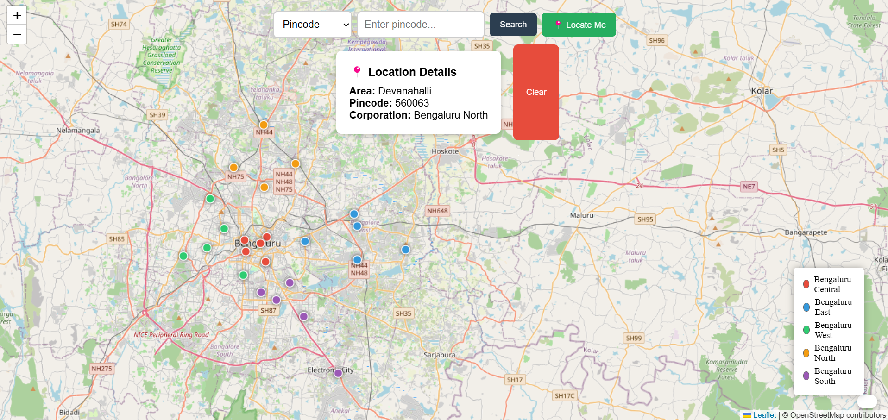

# Bangalore Pincode Map Explorer

An interactive map of Bengaluru’s localities with pincode lookup, reflecting the 2026 5‑corporation model.

## Features
- Click map markers → area, pincode, corporation
- Search by pincode → map zooms and highlights
- Search by area name → pincode displayed
- Partial area matching
- Color‑coded markers per corporation
- Responsive design
- Locate Me (bonus)

## Tech Stack
Frontend: React, react‑leaflet, Axios  
Backend: Python, FastAPI

## Setup Instructions

### Backend
1. cd backend
2. python -m venv venv
3. source venv/bin/activate (Windows: venv\Scripts\activate)
4. pip install -r requirements.txt
5. uvicorn main:app --reload
   Runs on http://localhost:8000

### Frontend
1. cd frontend
2. npm install
3. npm start
   Opens http://localhost:3000

## Live Demo
Service	URL
Frontend	https://6a01d47771d2c60c62b2c71c--bangalore-pincode-map-explorer.netlify.app
Backend	https://bangalore-pincode-map-explorer.onrender.com (Swagger: /docs)
Frontend is deployed on Netlify, backend on Render.

## Screenshot

## Dataset
pincodes.json with 25+ areas across 5 corporations.